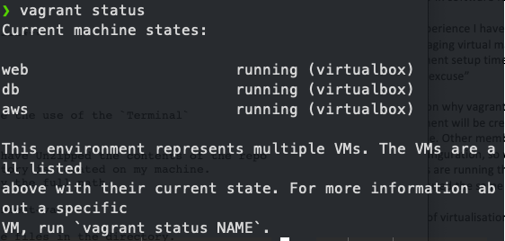

### How to get nodejs App up and running using Ansible

### Prerequisites
- `virtualBox` [download here](https://www.virtualbox.org/wiki/Downloads)
- `Vagrant` [download here](https://www.vagrantup.com/downloads)
- `Ansible` - This will be downloaded once inside the vm

## 1. Download the contents of the repo
- Download the contents of the this repo

## 2. Once in the directory with the vagrantfile
```bash
vagrant up
```

## 3. Vagrant status to verify the the vms that have been created
```bash
vagrant status
```


